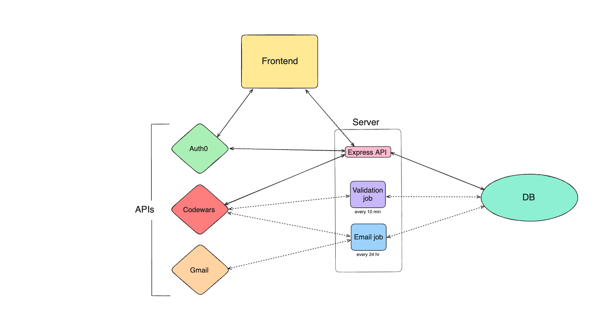
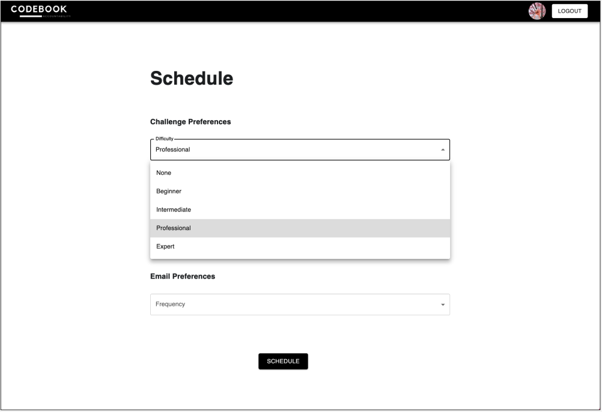

<h1 align="center">
  <br></br>

</h1>


Project is live on [Render](https://server-zqle.onrender.com/)!
<br></br>
DISCLAIMERS: 
 * A Google account is required to sign up via Auth0
 * To unsubscribe from emails, set every field in your schedule to "None"
<br></br>

## Table of Contents
* [Introduction](#introduction)
* [Demo](#demo)
* [Installation](#installation)
* [Architecture](#architecture)
* [User Flow](#user-flow)
* [Database Schema](#database-schema)
* [System Design](#system-design)
* [Screenshots](#screenshots)
* [Design Considerations](#design-considerations)
* [Alternatives](#alternatives)
* [Technologies](#technologies)
* [Features](#features)
* [About the Developer](#about-the-developer)


## Introduction
CodeBook is an interview prep accountability tool that prepares users for software engineering coding interviews. 

Users will sign-up through Auth0 and provide their Codewars username to the app. Before they can use the app's main features, users must pass validation and prove that they are truly the rightful owner of the Codewars account. 

Once a user has been validated, they can choose their code challenge and email preferences. According to the user's preferences, the app will send the user automated emails containing links to code challenges and/or reminders to complete their challenges.

This app does not provide an environment in which users can solve coding challenges.


## Demo
https://github.com/dabinkim807/codebook/assets/113155586/fa9d0c09-9fed-41fb-b0d4-fc3256bd54bf


## Installation
__This project requires Auth0! Please visit [Auth0](https://auth0.com/) to make an account and retrieve a domain and client ID. See .env.example for set up!__

Step 1: Clone project & switch into the project directory.

```
  git clone git@github.com:dabinkim807/codebook.git
  cd codebook
```
  
Step 2: Install all packages.

```
  cd client && npm install && cd ../server && npm install
```

Step 3: Setup Environment Variables

* Copy the instructions from both .env.example files in the client and server.

Step 4: Connect the database and the data.

```
  cd server
  psql codebook -f db.sql
```

Step 5: Start the program!

```
  cd server && npm run dev
```

Note: Client server will be running on http://localhost:5173 and server will be running on http://localhost:8080.


## Architecture
<p align="center"></p>


## User Flow
<p align="center"></p>


## Database Schema
<p align="center"></p>


## System Design

### Set-up & Validation
1. The user will open the app and see a landing page where they are prompted to sign-in.
<br></br>
2. The user will sign-in through Auth0, which will currently only provide the option to connect to Google accounts, due to the project's scope limitations. If they are a new user, they will be directed to the validation page. If they are a returning user, they will be directed to the scheduling page.
<br></br>
3. On the validation page, the user will be prompted to either create a Codewars account if they do not have one already and/or submit their existing Codewars username to the app via a submit button.
<br></br>
4. The backend will first validate the submitted username against existing users in the users table. If the user does not exist in the database, the backend will then validate the user against existing users in Codewars by calling the Codewars API and fetching user data.
<br></br>
5. Codewars provides List of Code Challenges API. To get a list of a user's total completed code challenges, a username will be passed as parameter in the HTTP request.
<br></br>
6. Once the user has submitted their Codewars username, the app will make a call to the Codewars API to access the user's total completed code challenges.
<br></br>
7. The app will select a random, beginner-level, hard-coded code challenge from the database and check that the code challenge ID does not exist in the user's total completed challenges.
<br></br>
8. The validation page will then prompt the user to complete the challenge via an external link to Codewars. The purpose of this test is to validate that the user is truly the rightful owner of the Codewars username they have submitted.
<br></br>
9. To limit the possibility of a malicious user claiming someone else's Codewars username, a time limit of 10 minutes will be enforced from the moment the user clicks on the submit button.
<br></br>
10. Once the time limit has passed, the backend will call the Codewars API again to verify whether the user's list of total completed challenges has been updated to include the test.
<br></br>
11. If the user's list of total completed challenges is updated successfully, the user is most likely valid. The user will be marked as validated and will then be able to access the app's scheduling page.
<br></br>
12. If at any point between steps 6-12 the user is invalid or they have failed to pass the test within the designated time limit, the user will be left as not validated and will be prompted to resubmit their Codewars username and restart the validation process.
    <br></br>
    1. Since the first step in the validation process is to check whether the user is an existing user in the database, a user who has failed the validation process will be treated like a new user.
    <br></br>
    2. Users can make an unlimited amount of sign-up attempts.
    <br></br>
    3. A scheduled job will periodically delete any users who are not validated and who have exceeded the 10-minute deadline to complete the test.

<br></br>

### Scheduling Code Challenges
1. On the scheduling page, the user will be able to choose the difficulty level and topic of their code challenges and how frequently they will be received (e.g. one code challenge per week, every Sunday).
<br></br>
2. The user will also be able to opt into receiving reminder emails to solve their code challenges, and if so, how often they would like to be reminded.
<br></br>
3. All user preferences will be stored in the database. A scheduled job will do the following:
    <br></br>
    1. Randomly select a code challenge that matches the user's preferences and is not currently in their list of total completed challenges.
    <br></br>
    2. Send the user emails with links to their code challenges, based on the user's preferences.
    <br></br>
    3. Send the user reminder emails based on the user's preferences.
    <br></br>
    4. Mark user's assigned code challenge as passed if user completes challenge successfully within the deadline or failed if the user has not completed the challenge successfully by the deadline.

<br></br>

## Screenshots
<p align="center"></p>
<br></br>
<p align="center"></p>
<br></br>
<p align="center"></p>
<br></br>
<p align="center"></p>

<br></br>

## Design Considerations

### Assumptions and Dependencies
* For its functionality, the project depends heavily on the following external APIs: [Auth0](https://auth0.com/), [Codewars](https://dev.codewars.com/#list-completed-challenges), and [Gmail](https://developers.google.com/gmail/api/guides). The assumption is that these APIs will not become deprecated in the near future.
* The project relies on a personal Gmail account with a limited number of emails that can be sent (2,000 per day). This dependency assumes that the project will not be popular enough to exceed that limitation.

### General Constraints
* Resources - the app depends on free resources, and must be fully completed within 4 weeks
* Technologies/Stack - the app must be completed using the PERN stack (PostgreSQL, Express.js, React.js, Node.js)
* [Guidelines](https://docs.google.com/document/d/1pv1TujurbSVVrZJzQSojTMEi3OIHWhnQUlnZoBRp7G0/edit)


## Alternatives

### LeetCode
* Much more straightforward in terms of questions, ranking system, and UI
* Used frequently in job interviews
* Questions are regulated; only LeetCode admin can create questions
* Overall, LeetCode is much better at preparing people for job interviews, which is the goal of this app

So why was Codewars chosen instead?
* LeetCode doesn’t have its own API – there are unofficial repositories of LeetCode challenges, and hard-coding is always an option, but:
* One of the requirements of this project was to use an API whose data will be consumed by the app


## Technologies
* Node.js v19.2.0
* PostgreSQL v14.7 (Homebrew)
* Express.js v4.18.2
* Vite v4.2.0


## API References
* [Auth0 Authentication API](https://auth0.com/docs/api/authentication)
* [Auth0 Management API](https://auth0.com/docs/api/management/v2)
* [Codewars: List of Code Challenges API](https://dev.codewars.com/#list-completed-challenges)
* [Gmail API](https://developers.google.com/gmail/api/guides)


## Features
* Choose code challenge category, difficulty, and frequency
* Choose whether you want to receive reminder emails, and how often


## About the Developer
Dana is a former Accounts Receivable Claims Analyst who became interested in software engineering through looking into streamlining data for her previous job. She is interested in the backend and solving interesting problems that end users care about.

Connect with me on [LinkedIn](https://www.linkedin.com/in/danadabinkim/)!


<p align="right">(<a href="#introduction">back to top</a>)</p>

